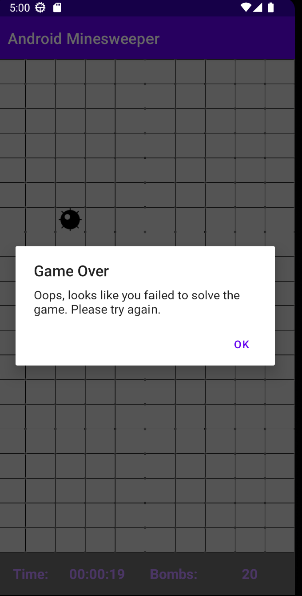

# android-minesweeper
## Description
Our own implementation of the legendary Minesweeper game inside an Android App.  
It includes varying difficulties to choose from and a high-score list to check out your best runs.
A simple help page explains the games mechanics and the other parts of the app.
There is also an included darkmode to lessen the strain on your eyes (especially at night 😉) 

## Which points we want to achieve

| Description                                                                 |   Points    |
|:----------------------------------------------------------------------------|:-----------:|
| Screen: Start                                                               |      1      |
| Screen: New Game and Game                                                   |    1 + 4    |
| Jetpack-component: `RecyclerView` (In `BoardAdapter` and `HigscoreAdapter`) |      2      |
| Screen: High-score                                                          |      2      |
| Screen: Help page                                                           |      2      |
| Jetpack-component: `ViewPager2` in `HelpViewPagerAdapter`                   |      2      |
| Usage of Kotlin                                                             |      6      |
| Persistence: High-score list using `Room` database                          |      3      |
| Persistence: Darkmode settings                                              |      1      |
| View binding                                                                |      2      |
| Dark theme                                                                  |      1      |
| <h4>Total</h4>                                                              | <h4>27</h4> |

## Screenshots
### Start-Screen

 

 

--- 

### New Game and Game screens

 

 

--- 
### High-Score and Help

 

 

--- 
### Game Over

 

